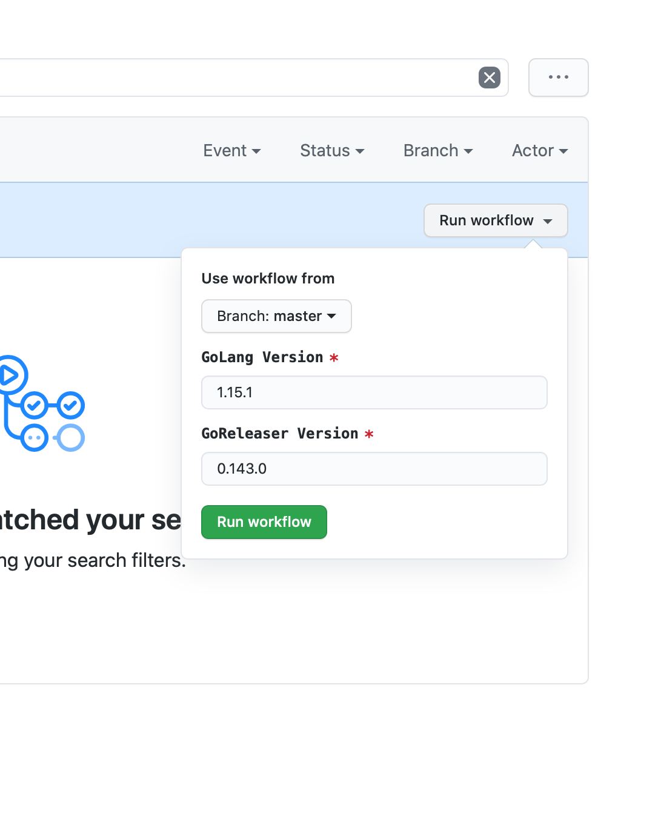

# oryd/xgoreleaser

This image is published as
[oryd/xgoreleaser](https://hub.docker.com/r/oryd/xgoreleaser).
It's tag (e.g. 1.13.5) reflects the Golang version used. This is a fork of
[docker/golang-cross](https://github.com/docker/golang-cross). Alternatives
include:

- [elastic/golang-crossbuild](https://github.com/elastic/golang-crossbuild)

## Build in CI

First, check the versions for:

- [Golang](https://golang.org/dl/)
- [GoReleaser](https://github.com/goreleaser/goreleaser/releases)

The use
[this workflow](https://github.com/ory/xgoreleaser/actions?query=workflow%3ADocker)
to build and publish the image. **Do not use `v` prefixes in the version!**



## Building Locally

To build this image, run locally:

```shell script
go_version=1.15.2
goreleaser_version=0.143.0
docker build --build-arg GO_VERSION=${go_version} --build-arg GORELEASER_VERSION=${goreleaser_version} -t oryd/xgoreleaser:${go_version}-${goreleaser_version} .
docker tag oryd/xgoreleaser:${go_version}-${goreleaser_version} oryd/xgoreleaser:latest
docker push oryd/xgoreleaser:${go_version}-${goreleaser_version}
docker push oryd/xgoreleaser:latest
```

To build this image using the CI, create a new release with the desired Golang
version.

## Testing Builds

You can test a build using

```shell script
$ docker pull oryd/xgoreleaser:latest
$ docker run --mount type=bind,source="$(pwd)",target=/project \
    oryd/xgoreleaser:latest --skip-publish --snapshot --rm-dist
```

or exec into the container:

```shell script
$ docker run --mount type=bind,source="$(pwd)",target=/project \
  --entrypoint /bin/bash -it oryd/xgoreleaser:latest
```

## Updating Dependencies

Go tends to remove support for older macOS SDKs which requires re-packaging and
uploading the macOS SDK to Google Cloud. To learn how to package it, check out
[this guide](https://github.com/tpoechtrager/osxcross#packaging-the-sdk). Next,
upload the generated file and mark it public in this
[Google Cloud Storage Bucket](https://console.cloud.google.com/storage/browser/ory.sh/build-assets?project=ory-web).
