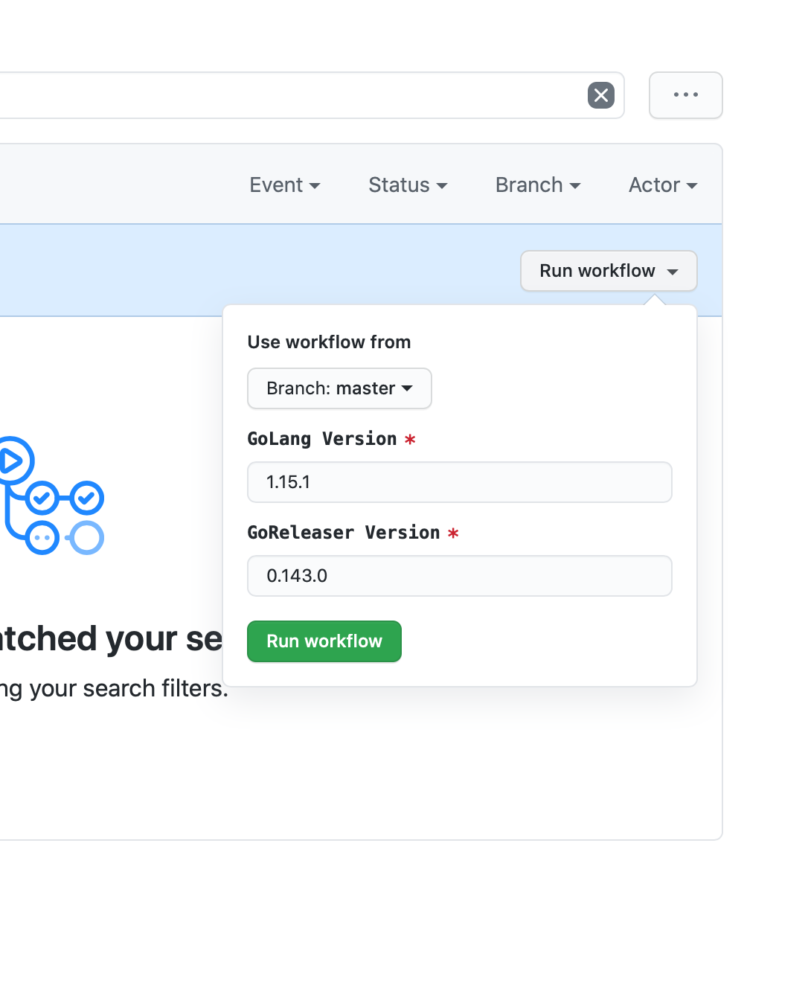

# oryd/xgoreleaser

This image is published as
[oryd/xgoreleaser](https://hub.docker.com/r/oryd/xgoreleaser).
It's tag (e.g. 1.13.5) reflects the Golang version used. This is a fork of
[docker/golang-cross](https://github.com/docker/golang-cross). Alternatives
include:

- [elastic/golang-crossbuild](https://github.com/elastic/golang-crossbuild)

## Build in CI

First, check the versions for:

- [Golang](https://golang.org/dl/)
- [GoReleaser](https://github.com/goreleaser/goreleaser/releases)

The use
[this workflow](https://github.com/ory/xgoreleaser/actions?query=workflow%3ADocker)
to build and publish the image. **Do not use `v` prefixes in the version!**



## Using the Build Template

The shared config is split into two files:

- `build-base.tmpl.yml` — common infrastructure plus the CGO-disabled
  builds (`default`, `static-nosqlite`), their archives, the distroless
  Docker images, and their manifests. Pure-Go and needs no C toolchain.
- `build-cgo.tmpl.yml` — the SQLite/HSM CGO build matrix plus everything
  that ships those binaries: the `*-cgo` archives, Homebrew, Scoop, the
  Alpine Docker images, and the `:tag`/`:major`/`:minor`/`:patch`/`:latest`
  Docker manifests.

`build.tmpl.yml` is a backward-compatible aggregator that pulls in both via
nested `from_url` includes. Existing consumers do not need to change.

### Full matrix (CGO + no-CGO)

```yml
# Include the aggregator — same behavior as before.
includes:
  - from_url:
      url: https://raw.githubusercontent.com/ory/xgoreleaser/master/build.tmpl.yml

variables:
  # The name of the brew tap formula:
  # 
  # brew install ory/tap/<brew_name>
  brew_name: cli

  # The description of the brew formula:
  brew_description: ""
  
  # The variable where we store the build's git hash
  buildinfo_hash: "github.com/ory/cli/buildinfo.GitHash"

  # The variable where we store the build's version
  buildinfo_tag: "github.com/ory/cli/buildinfo.Version"

  # The variable where we store the build's time
  buildinfo_date: "github.com/ory/cli/buildinfo.Time"


# The name of the project (e.g. kratos, ory, ...). Used
# to name the binary, docker images, etc.
project_name: ory
```

### No-CGO only

For projects that do not need SQLite/HSM (e.g. `ory/cli`), include only the
base template. This drops the entire CGO build matrix, the `*-cgo`
archives, Homebrew, Scoop, the Alpine Docker images, and their manifests.
Distroless images and their `:tag-distroless` / `:vMAJOR.MINOR.PATCH-distroless`
manifests are still published.

```yml
includes:
  - from_url:
      url: https://raw.githubusercontent.com/ory/xgoreleaser/master/build-base.tmpl.yml

variables:
  buildinfo_hash: "github.com/ory/cli/buildinfo.GitHash"
  buildinfo_tag: "github.com/ory/cli/buildinfo.Version"
  buildinfo_date: "github.com/ory/cli/buildinfo.Time"

project_name: ory
```

If you still want Homebrew/Scoop/Alpine Docker for a no-CGO project, add
those blocks directly in your own `.goreleaser.yml` referencing the
`default` archive/build id.

## Building Locally

To build this image, run locally:

```shell script
# Enable Docker experimental features and buildx
export DOCKER_CLI_EXPERIMENTAL=enabled
docker buildx create --use

go_version=1.17.5
goreleaser_version=1.1.0
docker buildx build \
  --load \
  --build-arg GO_VERSION=${go_version} --build-arg GORELEASER_VERSION=${goreleaser_version} \
  --platform linux/amd64 \
  -t oryd/xgoreleaser:${go_version}-${goreleaser_version} \
  -t oryd/xgoreleaser:latest \
  .
```

To build this image using the CI, create a new release with the desired Golang
version.

## Testing Builds

You can test a build using

```shell script
docker pull --platform linux/amd64 oryd/xgoreleaser:latest
docker run --mount type=bind,source="$(pwd)",target=/project \
    --platform linux/amd64 \
    -e GORELEASER_KEY=$GORELEASER_KEY \
    -v /var/run/docker.sock:/var/run/docker.sock \
    oryd/xgoreleaser:latest --skip-publish --snapshot --rm-dist
```

or exec into the container:

```shell script
docker run --mount type=bind,source="$(pwd)",target=/project \
  --platform linux/amd64 \
  -e GORELEASER_KEY=$GORELEASER_KEY \
  -v /var/run/docker.sock:/var/run/docker.sock \
  --entrypoint /bin/bash -it oryd/xgoreleaser:latest
```

## Updating Dependencies

Go tends to remove support for older macOS SDKs which requires re-packaging and
uploading the macOS SDK to Google Cloud. To learn how to package it, check out
[this guide](https://github.com/tpoechtrager/osxcross#packaging-the-sdk). Next,
upload the generated file and mark it public in this
[Google Cloud Storage Bucket](https://console.cloud.google.com/storage/browser/ory.sh/build-assets?project=ory-web).

## Updating Build Template

The build templates are ingested by all projects (e.g. Ory Kratos) and
modified slightly to fit the needs of the project. When editing, remember
that [`build.tmpl.yml`](./build.tmpl.yml) is now a thin aggregator —
substantive changes belong in [`build-base.tmpl.yml`](./build-base.tmpl.yml)
(no-CGO common pieces) or [`build-cgo.tmpl.yml`](./build-cgo.tmpl.yml)
(CGO add-ons).
